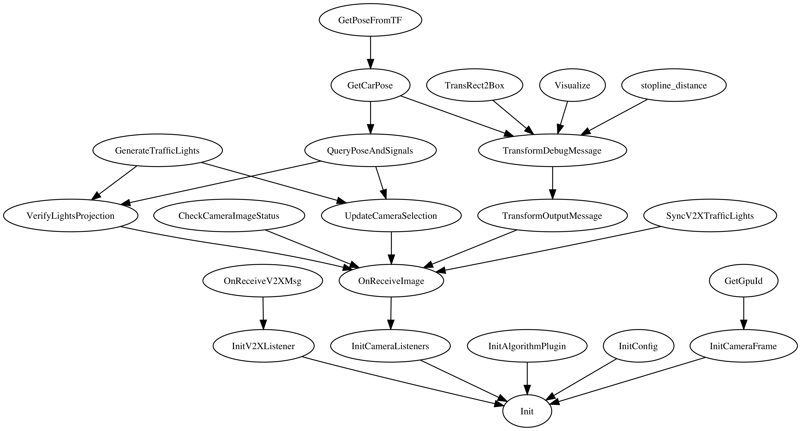

阅读[Baidu Apollo](https://github.com/ApolloAuto/apollo) 代码中可能会用到的一些小工具

## callgraph.py

给定cpp文件（以及对应的头文件，通常就是某个class），分析函数调用关系，这里只考虑这些文件内定义的函数他们之间的彼此调用关系。
注意这里采用的简单的字符串匹配的方式，不涉及任何AST，给的也是一个非常初步的结果，而且很可能还会有错误，因此只适合前期看代码非常初步的参考！不过由于最后生成就是一个dot文本文件，因此有需要可以再做一些手工的更改。

使用方式，假设要分析的是 apollo/traffic.cpp 和 对应的头文件 apollo/traffic.h 文件
```sh
python callgraph -f apollo/traffic.cpp apollo/traffic.h
```
输出 traffic.dot 文件，类似这样
```
digraph traffic {
	graph [dpi=500]
	InitV2XListener -> Init
	InitCameraListeners -> Init
	InitAlgorithmPlugin -> Init
	InitConfig -> Init
	InitCameraFrame -> Init

	OnReceiveImage -> InitCameraListeners

	OnReceiveV2XMsg -> InitV2XListener

	GetGpuId -> InitCameraFrame

	UpdateCameraSelection -> OnReceiveImage
	CheckCameraImageStatus -> OnReceiveImage
	VerifyLightsProjection -> OnReceiveImage
	TransformOutputMessage -> OnReceiveImage
	SyncV2XTrafficLights -> OnReceiveImage

	GetCarPose -> QueryPoseAndSignals

	QueryPoseAndSignals -> VerifyLightsProjection
	GenerateTrafficLights -> VerifyLightsProjection

	QueryPoseAndSignals -> UpdateCameraSelection
	GenerateTrafficLights -> UpdateCameraSelection

	GetPoseFromTF -> GetCarPose

	TransformDebugMessage -> TransformOutputMessage

	TransRect2Box -> TransformDebugMessage
	Visualize -> TransformDebugMessage
	stopline_distance -> TransformDebugMessage
	GetCarPose -> TransformDebugMessage
}
```

使用graphviz工具，可以再将其转成 图片 格式，类似这样
```
dot traffic.dot -Tpng -o traffic.png
```

最终得到下边这个图

